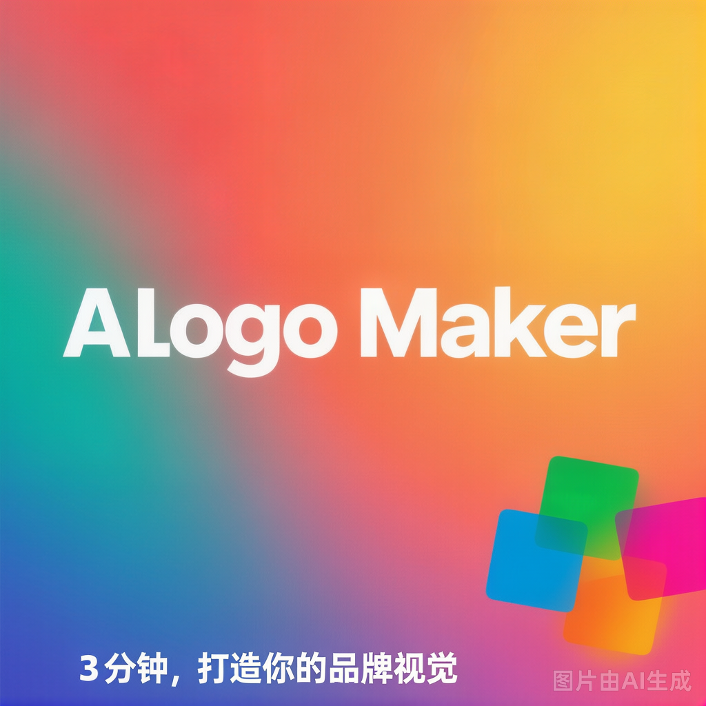

# AI Logo Maker

> Create professional logos in 30 seconds — no design skills needed.



## Features

- 🤖 **AI-Powered Generation** — Describe your brand, get 5 unique concepts in 30 seconds
- 🎨 **Full Brand Kit** — Logo + Business Card + Social Media + Favicon, all matching
- 🎯 **Industry-Specific Design** — Trained on 10,000+ professional logos across 10+ industries
- 📐 **Vector Output** — SVG/PNG/PDF, print-ready, no quality loss
- ⚡ **Lightning Fast** — From idea to downloadable logo in under 2 minutes

## Tech Stack

- **Framework**: Next.js 16 (App Router)
- **Styling**: Tailwind CSS 4
- **Language**: TypeScript
- **Deployment**: Cloudflare Pages / Vercel

## Getting Started

```bash
# Install dependencies
npm install

# Start development server
npm run dev

# Build for production
npm run build

# Start production server
npm start
```

## Pricing

| Plan | Price | Features |
|------|:-----:|----------|
| Free | $0 | 5 logo concepts, watermarked preview |
| Pro | $19.9 | High-res download, full brand kit, commercial license |
| Team | $49/mo | Unlimited generations, priority support, team collaboration |

## Deploy

See [deploy-guide.md](deploy-guide.md) for Cloudflare Pages deployment instructions.

## License

MIT © 2026
